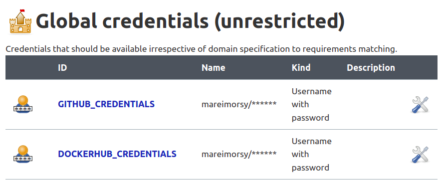
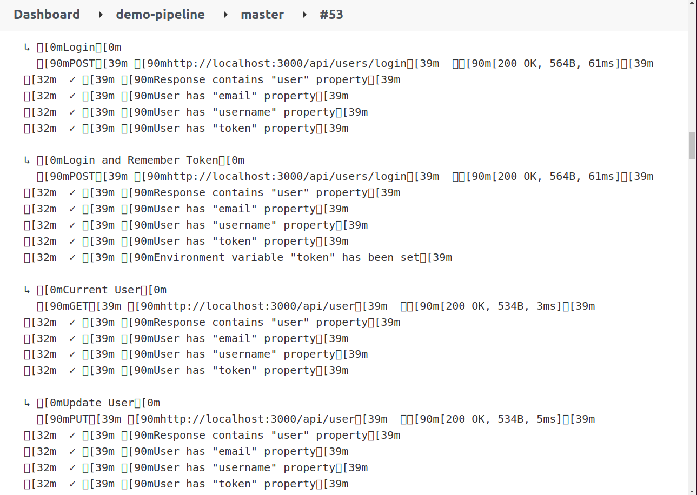
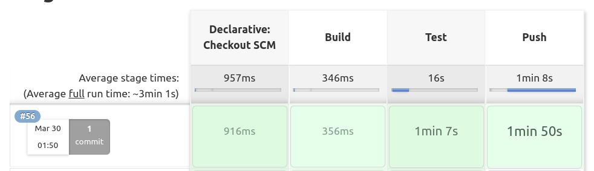

# SRE challenge

## Deliverables

* [Dockerfile](Dockerfile) & [docker-compose](docker-compose.yaml)
* [Jenkins File](Jenkinsfile)

I ran jenkins in docker inside my local machine as following
```
docker run --name jenkins -p 8080:8080 -p 50000:50000 --group-add 0 -v /home/marei/jenkins_home:/var/jenkins_home -v /var/run/docker.sock:/var/run/docker.sock jenkins-in-docker
```
also Installed the following plugins
* Git
* Credentials
* Credentials Binding Plugin
* Docker plugin
* Docker Pipeline
* CloudBees Docker Build and Publish plugin

also added the following credentials to be used later in the pipelines

Here's a screenshot when tests are running in the `Test`` stage in the pipeline

Here's a screenshot when all pipelines succeed


* Here's all [k8s manifests](k8s/), in order to create them, just run the following command
```
kubectl create -f k8s/
```
* install [nginx ingress controller](https://docs.nginx.com/nginx-ingress-controller/installation/installation-with-manifests/)

if you're running minikube you should enable the ingress addon like this
```
minikube addons enable ingress
```